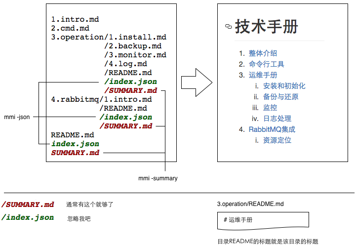

# [M]ake [M]arkdown [I]ndex

## 这是个什么工具?

我理想中的文档系统:

* 支持多人编辑
* 支持版本化
* 可以生成一个站点
* 可以生成一本书.  epub/mobi/pdf格式.
* pdf打印出来要非常漂亮

文档有两种,  一种是一篇文章,  另一种是一本书,  有着清晰的目录结构. 我们这里谈论的是后者.

[Gitbook](https://www.gitbook.com/)是个不错的工具: 使用[Markdown的文法](http://wowubuntu.com/markdown/),  用[Github](https://github.com/)进行文档历史管理与协同编辑. 可以生成包括pdf在内的多种格式供下载.

但是你需要自己创建他的索引文件 - ``SUMMARY.md``

于是就有了这个工具``mmi``:

1. 按照``mmi``预订的格式组织文档的目录, ``mmi``会维护所有的``SUMMARY.md``. 约定替代配置, 所有用mmi写出来的文档, 目录组织风格一致.
1. 本地开发的时候, ``mmi``可以作为webserver启动,  你可以在浏览器里直接所见即所得.
1. ``mmi``可以生成tex格式, [太阳系里最优雅的排版系统](http://www.ctex.org/TeX).
1. 如果你要自己写个程序根据文档生成站点,  可能需要些目录里的**"跳转标识"**, 比如**"上一页/下一页"**. 比如当前的**导航路径**.  ``mmi``会在每个目录下生成一个``index.json``, 供程序读取.

至于为什么选Markdown. 请参照 [为什么作家应该用 Markdown 保存自己的文稿]
(http://apple4us.com/2012/02/why-writers-should-use-markdown/).

## 目录组织规范

* 所有的文件都是Markdown格式. 格式为 ``01.aaa.md``.
* 子目录也是同样``02.bbb``, 里面要放置一个``02/README.md``, 只有存在``README.md``, mmi才会将这个目录作为文档目录看待.



## 使用说明

- mmi -summary &lt;workdir&gt; 遍历workdir, 在所有文档子目录生成SUMMARY.md.
- mmi -json &lt;workdir&gt; 遍历workdir, 在所有文档子目录生成index.json文件.
- mmi -tex &lt;workdir&gt; 将workdir目录里的所有文档合并成一个tex文件.
- mmi -server &lt;workdir&gt; 作为Web服务器启动, 监听10080端口, 用浏览器访问 http://127.0.0.1:10080/ 吧.

## 项目示例

- 在线阅读:
 - Gitbook: https://www.gitbook.com/book/flaboy/prism
 - Github: https://github.com/shopex/prism-doc/blob/master/SUMMARY.md
- 源文件: https://github.com/shopex/prism-doc

## 使用技巧

* 支持中文文件名与目录名,  但建议英文为先.
* 文档用到的图片, 尽量生成一份同名的``pdf``格式. ``mmi -tex``会自动查找``img/a.pdf``来替换``img/a.(jpg|png|gif)``. 所有的素材都是矢量, 最终pdf文档才足够精美.
* 如果你会写[Makefile](http://blog.csdn.net/haoel/article/details/2886/), 自动化你的文档过程吧, [像这样](https://github.com/shopex/prism-doc/blob/master/Makefile).

## 获得mmi

* 已编译版本
    * mac用户(>=10.10.4, Yosemite), 在此下载 http://pan.baidu.com/s/1jGjGJDc
* 如果你有go的环境, 可以从源码安装.
    * ```go install github.com/flaboy/mmi```
